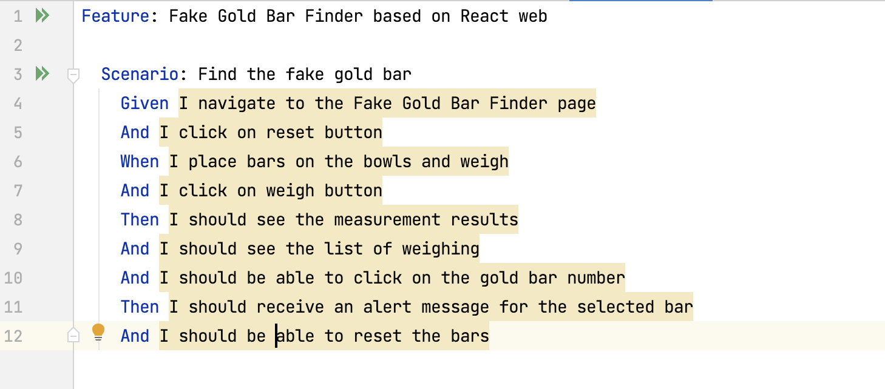

# FakeGoldBarFinder

The `FakeGoldBarFinder` project aims to identify the counterfeit gold bar among several genuine ones. This project encompasses several modules ranging from core algorithms to UI testing.

The website that I performed UI testing is http://sdetchallenge.fetch.com/.

## Table of Contents

- [Project Structure](#project-structure)
    - [Main Components](#main-components)
    - [Testing Components](#testing-components)
- [Usage](#usage)
    - [Prerequisites](#prerequisites)
    - [Running the Tests](#running-the-tests)
- [Additional Information](#additional-information)
- [Feedback and Suggestions](#feedback-and-suggestions)

## Project Structure

### Main Components

1. **GoldBarFinder**:
    - **Purpose**: Represents the core logic used to determine the method to identify the fake gold bar with the minimum number of weighing.

2. **GoldBarFinderTester**:
    - **Purpose**: This is the logic test class dedicated to testing the `GoldBarFinder`.

3. **GoldBarFinderTest**:
    - **Purpose**: A unit test class specifically for `GoldBarFinder`.

### Testing Components

1. **ReactApplicationTest**:
    - **Location**: `src/test`
    - **Purpose**: UI test class based on the website [http://sdetchallenge.fetch.com/](http://sdetchallenge.fetch.com/). The tests performed include:
        - **Navigation to Web Page**: Initially navigating to the specified base URL.
        - **Reset Button Test**: Testing the functionality of the reset button.
        - **Weighing Gold Bars**: Simulating a scenario of weighing gold bars by randomly selecting bars for the left and right bowls and triggering a weighing action. The test checks for expected weighing outcomes and logs the weighing results.
        - **Gold Bar Selection and Alert Verification**: After weighing, a gold bar is randomly selected, triggering an alert message. This message indicates if the chosen bar is the counterfeit one. The test verifies the alert's message against expected outcomes.
    - **DriverFactory**: 
        - **Location**: `src/test/java/drivers` 
        - **Purpose**:
            - **SafariDriver Configuration**: `DriverFactory` is responsible for setting up and configuring the SafariDriver for web automation testing on the Safari browser.
            - **Wait Variable**: Additionally, we can define a `wait` variable. This is pivotal for ensuring certain elements or conditions on the web page are met before any subsequent actions are taken, thus preventing potential synchronization issues during the tests.
        - **Usage**:
          1. Ensure you have SafariDriver installed and properly set up in your environment.
          2. When using the `DriverFactory` in tests, instantiate the driver and use the predefined `wait` mechanism wherever necessary to ensure stable and reliable tests.
    - **Purpose**: Defines the configurations for the web test using SafariDriver.

## Usage

### Prerequisites

1. Ensure the installation of SafariDriver to support web automation testing on Safari.
2. Ensure to include the dependencies needed to run the code, you may locate to the pom.xml file to see dependencies. However, if the version of the software conflicts, you may go to https://mvnrepository.com/ to choose the compatible denpendency.

### Running the Tests

1. To run the unit test for `GoldBarFinder`, execute the `GoldBarFinderTest` class.
2. To perform the web UI testing, execute the `ReactApplicationTest` class.

## Additional Information

The project adopts a strategic approach to test automation, particularly for web UI testing. Beyond the current configurations, I have come up with other considerations for expanding and refining the automation scope:

1. **TestNG Integration**:
    - One of the planned enhancements is the integration with TestNG. The move towards TestNG not only offers powerful test configurations and parallel executions but also brings enhanced reporting capabilities.

2. **Cucumber for BDD**:
    - The project is also envisioned to integrate with Cucumber, promoting Behavior Driven Development (BDD). Below is how I would design the feature file:

    

    - The rationale behind this is to employ a more natural language-like syntax for test cases which is both readable by non-technical stakeholders and executable as automated tests.
    - Leveraging Cucumber's feature files, the test methods have been sculpted, serving as step definitions. This ensures a seamless and fluid automation flow, allowing front-end UI tests to run automatically based on the described behaviors. I have also started a scratch version of what each test method looks like,

    

3. **Challenges with TestNG and React**:
    - While TestNG offers powerful testing capabilities, the decision not to use it for BDD in conjunction with React was influenced by a limitation: lack of access to the React web application's source code. Only the web URL was provided, restricting the depth of testing that could be accomplished using this framework in this context.

The fusion of TestNG and Cucumber positions the project for a more streamlined and comprehensive test automation execution. From my previous experience, I have learned that these strategies underline the commitment to enhance test reliability, readability, and collaboration across teams. Therefore, if I had the source code or frontend code like Node.js, I would be able to perform automation testing using testNG.

## Feedback and Suggestions

If you encounter any issues or have suggestions while using this project, please feel free to reach out at jamzhang29@gmail.com. Thank you for your time looking into this project. 
